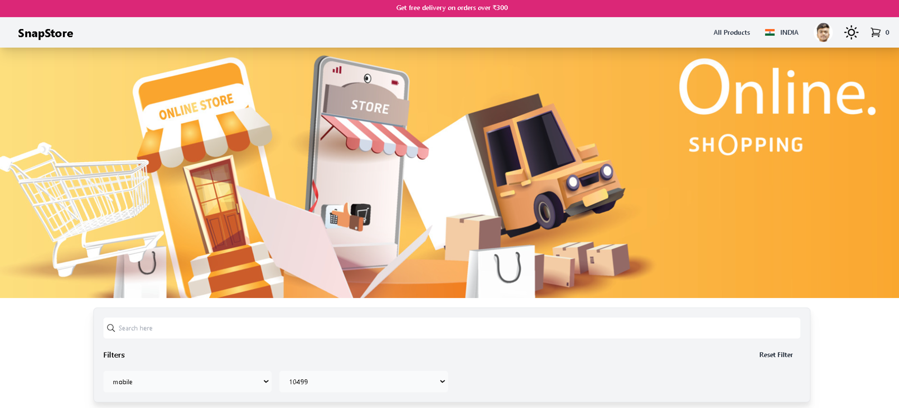

# **E-commerce Platform**

A robust e-commerce platform built with **React**, **Tailwind CSS**, **Firebase**, **Redux**, and **Razorpay**.

# **Image**
<a href='https://snapstore-alpha.vercel.app'></a>

# **View Live Demo**
<a href='https://snapstore-alpha.vercel.app'>View Live</a>

## **Key Features:**

- **Dynamic UI:** Powered by React for an interactive and engaging user experience.
- **Rapid Styling:** Tailwind CSS for efficient and consistent styling.
- **Backend and Database:** Firebase for real-time data synchronization and scalable infrastructure.
- **State Management:** Redux for managing complex application state.
- **Secure Payments:** Razorpay integration for secure payment processing.
- **Seamless Shopping:** Intuitive product browsing, cart management, checkout, and order tracking.

## **Tech Stack:**

- **Frontend:** React, Tailwind CSS, Redux
- **Backend:** Firebase
- **Payments:** Razorpay

## **Getting Started:**

1. **Clone the repository:**

   ```bash
   git clone https://github.com/your-username/e-commerce-platform.git
   ```

2. **Install dependencies:**

   ```bash
   cd e-commerce-platform
   npm install
   ```

3. **Set up environment variables:**  
   Create a `.env` file and add your Firebase and Razorpay API keys.

4. **Start the development server:**

   ```bash
   npm start
   ```

## **Deployment:**

- **Firebase Hosting:**  
  Deploy the application to Firebase for easy hosting and scaling.

## **Contributing:**

We welcome contributions! Please refer to the `CONTRIBUTING.md` file for guidelines.

## **License:**

This project is licensed under the MIT License.

## **Contact:**

For any inquiries, please contact us at [your email address].

## **Additional Information:**

- **Code Quality:**  
  We maintain high code quality standards through linting and testing.

- **Performance Optimization:**  
  The application is optimized for performance and responsiveness.

- **Accessibility:**  
  We prioritize accessibility to ensure the platform is usable by everyone.
